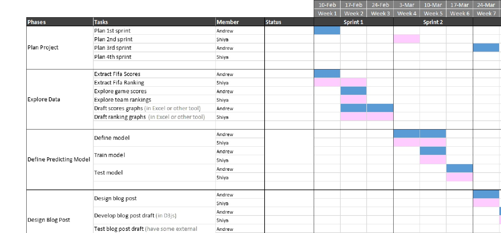

**Abstract:** With the kickoff of the 2014 Brazil World Cup fast approaching, soccer fans Shiya and Andrew are obsessed with same question to which every **soccer fan on the planet is dying to find out the answer: Who will capture the coveted trophy? What makes the waiting less unbearable for Shiya and Andrew is their scheme to use the tools that they are learning in the data sciences program at Columbia to answer the million-dollar question before the games even start. Shiya and Andrew are going to build a mathematical model that predicts each team’s likelihood of advancing into the next phase and eventually capturing the championship. Sounds ambitious? Yes, and below is how Shiya and Andrew are going to break down this daunting goal into manageable bits and pieces. 

**Method:** Shiya and Andrew will extract the FIFA rankings and FIFA scores from the official FIFA website. There will be a number of ways that Shiya and Andrew will play with the data. For instance, they will investigate the relationship between two teams’ rankings and the likelihood of one team eliminating/being eliminated by the other. They will take each team’s historical score in consideration as well, with more weight associated with the games that took place closer to 2014. Shiya and Andrew are also interested in learning and visualizing the relationship between a team’s score and its ranking with respect to another team. 

**Timeline:** Our project is divided into 4 sprints. The dates, duration, and responsibilities for each sprint are clearly indicated in the following graph.

